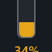

# Door Sense Card

[](https://github.com/custom-components/hacs)


A polished Lovelace card that treats your locks like first-class citizens—door sensor aware, per-state tap actions, battery indicator, responsive animations, and a full visual editor.

## Highlights

- 🎯 **Per-state tap actions** – dedicated locked/unlocked tap actions plus hold support; set an action to `none` to disable it entirely.
- 🚪 **Door sensor guard** – block taps and fade the icon whenever the paired contact sensor reports the door open.
- 🔋 **Low battery pill** – optional entity + threshold draws a color-mapped vertical gauge in any corner when the level drops.
- 🌀 **Smart animations** – snappy direct locked↔unlocked rotation, smooth staged slide/rotation choreography everywhere else.
- 🧪 **Local harness** – `test.html` simulates locks, door sensors, and batteries without Home Assistant.
- 📐 **Grid-friendly footprint** – defaults to a 2×6 span so it has breathing room without manual sizing tweaks.

## Visual States

|  |  |  |  |  |
| --- | --- | --- | --- | --- |
| _Door open_ | _Unlocked_ | _Lock requested_ | _Locking_ | _Locked_ |
|  |  |  |  |  |

### Battery Indicator

|  |  |
| --- | --- |
| Even the low battery pill gets some love—position it in any corner and let the color-coded fill call attention to the percentage without cluttering your layout. |  |

## Installation

### HACS (recommended)

1. Open **HACS → Frontend** and search for "Door Sense Card" (or add this repo as a custom source once).
2. Download/install, then restart Home Assistant if prompted.
3. The resource is registered automatically—just add the card to a dashboard.

### Manual

1. Grab `door-sense-card.js` from the [latest release](https://github.com/electricessence/Door-Sense-Card/releases).
2. Copy it to `/config/www/door-sense-card.js`.
3. Add a Lovelace resource pointing to `/local/door-sense-card.js` (type **JavaScript Module**).
4. Clear cache (`Ctrl+Shift+R` or `Cmd+Shift+R`).

Need a walkthrough? See [QUICKSTART.md](QUICKSTART.md).

## Quick Start

```yaml
type: custom:door-sense-card
entity: lock.front_door
door_entity: binary_sensor.front_door_contact   # optional
battery_entity: sensor.front_door_lock_battery # optional
```

## Key Options

| Option | Description |
| --- | --- |
| `door_entity` | Binary/contact sensor that must report closed before taps are accepted. |
| `battery_entity` + `battery_threshold` | Show the warning pill when the percentage hits the threshold (default 35%). |
| `battery_indicator_position` | `top-right` (default), `top-left`, `bottom-right`, or `bottom-left`. |
| `tap_action_locked` / `tap_action_unlocked` | Override tap behaviors per stable state; set action `none` to disable. |
| `requested_timeout` | Milliseconds before a requested state snaps back if HA never confirms it (default 15s). |

All other legacy options (custom colors, animation durations, slide offset, gradient speed, unlock direction, etc.) still work and are exposed in the visual editor. Full details live in [docs/STATE_MACHINE.md](docs/STATE_MACHINE.md).

## Development & Testing

- Run `pnpm test` for the unit/state-machine suite.
- Open `test.html` with `pnpm serve` (or any static server) to play with the interactive harness.
- Contributions welcome—please keep the changelog up to date.

## Troubleshooting

- Card missing? Confirm the resource is loaded (HACS handles this) and hard-refresh the browser.
- Actions blocked? Make sure the door sensor is closed and you are in a stable state (locked/unlocked).
- Battery pill absent? Verify the entity returns a numeric percentage at/below the configured threshold.

## License

MIT © Door Sense Card contributors.
- 🎨 Animated lock icon with 6 visual states
- ⚡ Lightweight vanilla JS Web Component
- 📱 Mobile-friendly with long-press support

---

## License

MIT License - See LICENSE file for details

---

## Credits

Created by a senior UI component engineer for the Home Assistant community.

If you find this useful, consider:
- ⭐ Starring the repository
- 🐛 Reporting issues
- 💡 Suggesting features

---

## Support

- **Issues**: [GitHub Issues](https://github.com/electricessence/Door-Sense-Card/issues)
- **Discussions**: [GitHub Discussions](https://github.com/electricessence/Door-Sense-Card/discussions)
- **Home Assistant Community**: [Forum Thread](https://community.home-assistant.io/)

---

**Enjoy your door-aware animated locks! 🔐✨**
